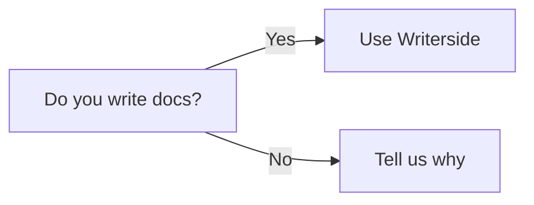

# All Writerside Use cases

## Add new topics {switcher-key="For Editor"}
You can create empty topics, or choose a template for different types of content that contains some boilerplate structure to help you get started:

{ width=290 }{border-effect=line}

## Basic grammar {collapsible="true" switcher-key="For Docs"}
> Blockquotes
>
> Nested
>> blockquotes
>
{style="tip"}

> Warning
>
{style="warning"}

> Note
>
{style="note"}

> Use ⌘+N to insert a Table, Link, Image easily
>

<tldr>
    <p>I am TL;DR</p>
</tldr>

### Definition lists
[Reference](https://www.jetbrains.com/help/writerside/definition-lists.html)

{style="narrow"}
First Term
: This is the definition of the first term.

Second Term
: This is the definition of the second term.

## Inject XML {switcher-key="For Docs"}
For example, this is how you inject a procedure:

<procedure title="Inject a procedure" id="inject-a-procedure">
    <step>
        <p>Start typing and select a procedure type from the completion suggestions:</p>
        
    </step>
    <step>
        <p>Press <shortcut>Tab</shortcut> or <shortcut>Enter</shortcut> to insert the markup.</p>
    </step>
</procedure>

## Add interactive elements {switcher-key="For Docs"}

### Tabs
To add switchable content, you can make use of tabs (inject them by starting to type `tab` on a new line):

<tabs>
    <tab title="Markdown">
        <code-block lang="plain text">{ width=450 }</code-block>
    </tab>
    <tab title="Semantic markup">
        <code-block lang="xml">
            <![CDATA[]]></code-block>
    </tab>
</tabs>

### Collapsible blocks
Apart from injecting entire XML elements, you can use attributes to configure the behavior of certain elements.
For example, you can collapse a chapter that contains non-essential information:

#### Supplementary info {collapsible="true" default-state="collapsed"}
Content under such header will be collapsed by default, but you can modify the behavior by adding the following attribute:
`default-state="expanded"`

### Convert selection to XML
If you need to extend an element with more functions, you can convert selected content from Markdown to semantic markup.
For example, if you want to merge cells in a table, it's much easier to convert it to XML than do this in Markdown.
Position the caret anywhere in the table and press <shortcut>Alt+Enter</shortcut>:


## Code Snippet {switcher-key="For Docs"}
### By library
<include from="Code.md" element-id="goch"></include>

### By \<snippets\>
```go
```
{src="bufch.go" include-lines="5-14" collapsed-title="buffered channel" collapsible="true"}

## Tooltip {switcher-key="For Docs"}
This is my <tooltip term="mytooltip">custom tooltip</tooltip>

## Mermaid {switcher-key="For Docs"}


### Math(Tex) {switcher-key="For Docs"}
```tex
\begin{equation}
x = \frac{-b \pm \sqrt{b^2 - 4ac}}{2a}
\end{equation}
```

<seealso>
    <category ref="wrs">
        <a href="https://plugins.jetbrains.com/plugin/20158-writerside/docs/markup-reference.html">Markup reference</a>
        <a href="https://plugins.jetbrains.com/plugin/20158-writerside/docs/manage-table-of-contents.html">Reorder topics in the TOC</a>
        <a href="https://plugins.jetbrains.com/plugin/20158-writerside/docs/local-build.html">Build and publish</a>
        <a href="https://plugins.jetbrains.com/plugin/20158-writerside/docs/configure-search.html">Configure Search</a>
    </category>
    <category ref="2">
        <a href="second-instance.md"></a>
    </category>
    <category ref="1">
        <a href="Child-Reference.md"/>
    </category>
</seealso>
